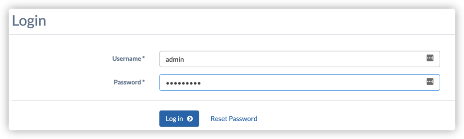

# CDN-In-A-Box (CIAB)

CIAB uses docker compose to quickly build a full ATC stack in your local docker environment. It is very helpful to the new users to learn ATC. 

BTW, the CIAB is not recommended for the production use, it just for the learn purpose. 

https://traffic-control-cdn.readthedocs.io/en/latest/admin/quick_howto/ciab.html
https://github.com/apache/trafficcontrol/tree/master/infrastructure/cdn-in-a-box

## My Installation Steps

### Install docker&docker-compose

- Docker version >= 17.05.0-ce
- Docker Compose1 version >= 1.9.0

### Clone ATC GitHub repository

```
$ git clone git@github.com:apache/trafficcontrol.git
```
### Build RPM packets
Each container (except the origin) requires an .rpm file to install the Traffic Control component for which it is responsible. You can download these *.rpm files from an archive (e.g. under "Releases"), use the provided Makefile to generate them (simply type make while in the cdn-in-a-box directory) or create them yourself by using the pkg script at the root of the repository.

Here I used the make to build packets on my local machine (It takes a long time depending on your network).

```
$ cd trafficcontrol/infrastructure/cdn-in-a-box
$ make
...
$ docker-compose build --parallel
...
```

### Startup the ATC stack

```
$ docker-compose -f docker-compose.yml -f docker-compose.expose-ports.yml up
...
```

The above cmd would start the whole ATC CIAB stack in your local docker environment, and also exposes the [ports](https://traffic-control-cdn.readthedocs.io/en/latest/admin/quick_howto/ciab.html#id19) to your local host network. Then in this way, you can access the portal from external network.

There would be many logs continuously print out. If you don't want to print the log on console, you can add a `-d` option to detach binding to the terminal:
```
$ docker-compose -f docker-compose.yml -f docker-compose.expose-ports.yml up -d
```

### Verify the installation
Simply run the following CMD to verify the CDN traffic
```
# sudo docker-compose exec enroller /usr/bin/curl -i -L "http://video.demo1.mycdn.ciab.test"
HTTP/1.1 302 Found
Location: http://edge.demo1.mycdn.ciab.test/
Content-Length: 0
Date: Tue, 01 Dec 2020 14:41:47 GMT

HTTP/1.1 200 OK
Content-Type: text/html
Accept-Ranges: bytes
ETag: "1644844149"
Last-Modified: Mon, 23 Nov 2020 03:49:16 GMT
Cache-Control: public, max-age=300
Access-Control-Allow-Origin: *
Access-Control-Allow-Headers: Accept, Origin, Content-Type
Access-Control-Allow-Methods: GET, POST, PUT, OPTIONS
Content-Length: 1881
Date: Tue, 01 Dec 2020 14:41:30 GMT
Server: ATS/7.1.4
Age: 17
Connection: keep-alive
Via: http/1.1 edge.infra.ciab.test (ApacheTrafficServer/7.1.4 [uScHs f p eN:t cCHi p s ])

<!DOCTYPE html>
...
```
The domain `video.demo1.mycdn.ciab.test` is the CIAB prebuilt CDN setting, and it can only be accessed within the CIAB environment.  And if the above CDM shows the correct contents, then it means all you installations and configurations are correct. 

And from the result, we can see there is a http 302 redirect, so it uses the [DNS based traffic routing](https://traffic-control-cdn.readthedocs.io/en/latest/overview/traffic_router.html#dns-content-routing). 

### Login to the Traffic Portal

Since we've exposed the port with the `docker-compose.expose-ports.yml` file when start up the stack, it's accessible from the out side to login the Traffic Portal that binding on 443 port. 

So you can use your local browser to login the port with `https://localhost:443` (You need to add exception for this site since it has no certificate installed)



You can ge the default username and password in `TO_ADMIN_USER` and `TO_ADMIN_PASSWORD` from [variables.env](https://github.com/apache/trafficcontrol/blob/master/docs/source/admin/quick_howto/ciab.rst#variables-env)

