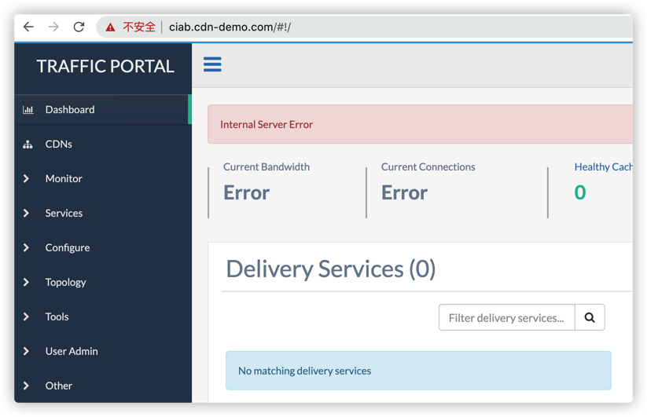

# Trouble Shooting 1 - Internal Server Error
## Issues
1. The CDN hostname can not be resolved.

Run the following the CMD to verify the CDN service, it returns error:
```
# sudo docker-compose exec enroller /usr/bin/curl -L "http://video.demo1.mycdn.ciab.test"
curl: (6) Could not resolve host: video.demo1.mycdn.ciab.test
```

2. The trafficPortal shows internal error, and can not find the DS.


## Debug Steps
### Check the container status
```
# sudo docker-compose exec enroller /usr/bin/curl -L "http://video.demo1.mycdn.ciab.test"
curl: (6) Could not resolve host: video.demo1.mycdn.ciab.test
```
The error shows the hostname is not correctly resolved. So firstly, let check whether all docker containers are correctly running:
```
# docker-compose ps
             Name                           Command                   State                                        Ports
--------------------------------------------------------------------------------------------------------------------------------------------------------
cdn-in-a-box_db_1                /bin/sh -c /run-db.sh            Up               0.0.0.0:5432->5432/tcp
cdn-in-a-box_dns_1               /sbin/entrypoint.sh /usr/s ...   Up               0.0.0.0:9353->53/tcp, 0.0.0.0:9353->53/udp
cdn-in-a-box_edge_1              /bin/sh -c /run.sh               Up               0.0.0.0:9000->80/tcp
cdn-in-a-box_enroller_1          /bin/sh -c /run.sh               Up
cdn-in-a-box_influxdb_1          /run-influxdb.sh                 Up               0.0.0.0:8086->8086/tcp
cdn-in-a-box_mid-01_1            /bin/sh -c /run.sh               Up               0.0.0.0:9100->80/tcp
cdn-in-a-box_mid-02_1            /bin/sh -c /run.sh               Up               0.0.0.0:9200->80/tcp
cdn-in-a-box_origin_1            /bin/sh -c /run.sh               Up               0.0.0.0:9300->80/tcp
cdn-in-a-box_smtp_1              /usr/bin/env run.sh              Up (healthy)     1025/tcp, 1080/tcp, 0.0.0.0:4443->443/tcp
cdn-in-a-box_trafficmonitor_1    /bin/sh -c /run.sh               Up (unhealthy)   0.0.0.0:80->80/tcp
cdn-in-a-box_trafficops-perl_1   /bin/sh -c /run.sh               Up               0.0.0.0:60443->443/tcp
cdn-in-a-box_trafficops_1        /bin/sh -c /run-go.sh            Up (healthy)     0.0.0.0:6443->443/tcp
cdn-in-a-box_trafficportal_1     /bin/sh -c /run.sh               Up               0.0.0.0:443->443/tcp
cdn-in-a-box_trafficrouter_1     /bin/sh -c /run.sh               Up               0.0.0.0:3333->3333/tcp, 0.0.0.0:2222->3443/tcp,
                                                                                   0.0.0.0:3443->443/tcp, 0.0.0.0:3053->53/tcp, 0.0.0.0:3053->53/udp,
                                                                                   0.0.0.0:3080->80/tcp
cdn-in-a-box_trafficstats_1      /bin/sh -c /run.sh               Up
cdn-in-a-box_trafficvault_1      /bin/sh -c /run.sh               Up               0.0.0.0:8087->8087/tcp, 0.0.0.0:8088->8088/tcp,
                                                                                   0.0.0.0:8098->8098/tcp
```
There are some status `Up (unhealthy)`, looks like the container is OK, but the internal status is not running. 

Let's check the unhealthy container log:

### Check the DNS resolver
#### Login to the enroller container to test the DNS
```
# docker-compose exec enroller bash
root@enroller:/shared/enroller# cat /etc/resolv.conf
# autogenerated by set-dns.sh
domain ciab.test
search infra.ciab.test ciab.test
nameserver 172.19.0.2
root@enroller:/shared/enroller# ping 172.19.0.2
PING 172.19.0.2 (172.19.0.2) 56(84) bytes of data.
64 bytes from 172.19.0.2: icmp_seq=1 ttl=64 time=0.187 ms
64 bytes from 172.19.0.2: icmp_seq=2 ttl=64 time=0.122 ms
64 bytes from 172.19.0.2: icmp_seq=3 ttl=64 time=0.120 ms
^C
--- 172.19.0.2 ping statistics ---
3 packets transmitted, 3 received, 0% packet loss, time 46ms
rtt min/avg/max/mdev = 0.120/0.143/0.187/0.031 ms
root@enroller:/shared/enroller# dig video.demo1.mycdn.ciab.test

; <<>> DiG 9.11.5-P4-5.1+deb10u2-Debian <<>> video.demo1.mycdn.ciab.test
;; global options: +cmd
;; Got answer:
;; ->>HEADER<<- opcode: QUERY, status: SERVFAIL, id: 21797
;; flags: qr rd ra; QUERY: 1, ANSWER: 0, AUTHORITY: 0, ADDITIONAL: 1

;; OPT PSEUDOSECTION:
; EDNS: version: 0, flags:; udp: 4096
; COOKIE: aa1fae0e65c276335a933a285fc513a9b6d92c825fbd14b0 (good)
;; QUESTION SECTION:
;video.demo1.mycdn.ciab.test.	IN	A

;; Query time: 1 msec
;; SERVER: 172.19.0.2#53(172.19.0.2)
;; WHEN: Mon Nov 30 15:45:45 UTC 2020
;; MSG SIZE  rcvd: 84

root@enroller:/shared/enroller#
```
DNS server's IP is `172.19.0.2`, it is reachable, but the hostname can not be resolved.

Let's login to the DNS container, to check:
```
# docker-compose exec dns bash
root@dns:/# dig video.demo1.mycdn.ciab.test

; <<>> DiG 9.11.3-1ubuntu1.13-Ubuntu <<>> video.demo1.mycdn.ciab.test
;; global options: +cmd
;; Got answer:
;; ->>HEADER<<- opcode: QUERY, status: NXDOMAIN, id: 23192
;; flags: qr aa rd ra; QUERY: 1, ANSWER: 0, AUTHORITY: 1, ADDITIONAL: 1

;; OPT PSEUDOSECTION:
; EDNS: version: 0, flags:; udp: 1280
;; QUESTION SECTION:
;video.demo1.mycdn.ciab.test.	IN	A

;; AUTHORITY SECTION:
test.			10800	IN	SOA	localhost. nobody.invalid. 1 3600 1200 604800 10800

;; Query time: 2 msec
;; SERVER: 127.0.0.11#53(127.0.0.11)
;; WHEN: Mon Nov 30 15:49:20 UTC 2020
;; MSG SIZE  rcvd: 115
```
The `dig` returns nothing, so seems the error happens to the dns server. 

Let's check the dns log, and found the following error log print once query the hostname:

```
# docker-compose logs -t -f dns
...
dns_1              | 2020-11-30T15:54:10.872544135Z 30-Nov-2020 15:54:10.872 connection refused resolving 'video.demo1.mycdn.ciab.test/A/IN': 172.19.0.10#53
```

Let's try to find which container owns the `172.19.0.10` IP address:

```
# docker network ls
NETWORK ID          NAME                   DRIVER              SCOPE
0342f347e10a        bridge                 bridge              local
05cc199cd5a0        build_default          bridge              local
4fd0730deae8        cdn-in-a-box_default   bridge              local
95b07c42b34f        host                   host                local
62b78f6c6220        none                   null                local

# docker network  inspect 4fd0730deae8
...
"fd1a8deb7c68cb9756f2d74de144926aa3a049eac8f4dc139f7184f91ee48ee2": {
                "Name": "cdn-in-a-box_trafficrouter_1",
                "EndpointID": "3b7683107ee4faccea7943f3e69d45d2e9fd1ef60b356f952915ca2e5a184260",
                "MacAddress": "02:42:ac:13:00:0a",
                "IPv4Address": "172.19.0.10/16",
                "IPv6Address": ""
            },`
...
```

We can see the `cdn-in-a-box_trafficrouter_1` owns the IP address, then let's check it's logs

```
# docker-compose ps --services  // Get the router service name
edge
mid-01
mid-02
dns
enroller
origin
trafficvault
trafficrouter  <<<<<<
trafficmonitor
trafficportal
influxdb
trafficstats
db
trafficops-perl
smtp
trafficops

# docker-compose logs -f -t trafficrouter
...
trafficrouter_1    | 2020-11-30T15:18:35.843521280Z ; <<>> DiG 9.11.13-RedHat-9.11.13-6.el8_2.1 <<>> @dns dns
trafficrouter_1    | 2020-11-30T15:18:35.843526978Z ; (1 server found)
trafficrouter_1    | 2020-11-30T15:18:35.843530332Z ;; global options: +cmd
trafficrouter_1    | 2020-11-30T15:18:35.843541968Z ;; Got answer:
trafficrouter_1    | 2020-11-30T15:18:35.843545160Z ;; ->>HEADER<<- opcode: QUERY, status: NOERROR, id: 8515
trafficrouter_1    | 2020-11-30T15:18:35.843548605Z ;; flags: qr rd ra; QUERY: 1, ANSWER: 1, AUTHORITY: 13, ADDITIONAL: 1
trafficrouter_1    | 2020-11-30T15:18:35.843551631Z
trafficrouter_1    | 2020-11-30T15:18:35.843554654Z ;; OPT PSEUDOSECTION:
trafficrouter_1    | 2020-11-30T15:18:35.843557992Z ; EDNS: version: 0, flags:; udp: 4096
trafficrouter_1    | 2020-11-30T15:18:35.843560984Z ; COOKIE: 0e64aa4ca300b404c0b2aa785fc50d4b62a704f6e9edc569 (good)
trafficrouter_1    | 2020-11-30T15:18:35.843563963Z ;; QUESTION SECTION:
trafficrouter_1    | 2020-11-30T15:18:35.843566984Z ;dns.				IN	A
trafficrouter_1    | 2020-11-30T15:18:35.843570177Z
trafficrouter_1    | 2020-11-30T15:18:35.843573200Z ;; ANSWER SECTION:
trafficrouter_1    | 2020-11-30T15:18:35.843576100Z dns.			597	IN	A	172.19.0.2
trafficrouter_1    | 2020-11-30T15:18:35.843579491Z
trafficrouter_1    | 2020-11-30T15:18:35.843582380Z ;; AUTHORITY SECTION:
trafficrouter_1    | 2020-11-30T15:18:35.843585365Z .			73682	IN	NS	e.root-servers.net.
trafficrouter_1    | 2020-11-30T15:18:35.843588555Z .			73682	IN	NS	g.root-servers.net.
trafficrouter_1    | 2020-11-30T15:18:35.843591734Z .			73682	IN	NS	b.root-servers.net.
trafficrouter_1    | 2020-11-30T15:18:35.843594716Z .			73682	IN	NS	c.root-servers.net.
trafficrouter_1    | 2020-11-30T15:18:35.843597714Z .			73682	IN	NS	k.root-servers.net.
trafficrouter_1    | 2020-11-30T15:18:35.843600839Z .			73682	IN	NS	j.root-servers.net.
trafficrouter_1    | 2020-11-30T15:18:35.843603830Z .			73682	IN	NS	h.root-servers.net.
trafficrouter_1    | 2020-11-30T15:18:35.843606806Z .			73682	IN	NS	l.root-servers.net.
trafficrouter_1    | 2020-11-30T15:18:35.843609933Z .			73682	IN	NS	i.root-servers.net.
trafficrouter_1    | 2020-11-30T15:18:35.843612945Z .			73682	IN	NS	a.root-servers.net.
trafficrouter_1    | 2020-11-30T15:18:35.843615935Z .			73682	IN	NS	m.root-servers.net.
trafficrouter_1    | 2020-11-30T15:18:35.843618918Z .			73682	IN	NS	f.root-servers.net.
trafficrouter_1    | 2020-11-30T15:18:35.843622041Z .			73682	IN	NS	d.root-servers.net.
trafficrouter_1    | 2020-11-30T15:18:35.843625031Z
trafficrouter_1    | 2020-11-30T15:18:35.843627928Z ;; Query time: 2 msec
trafficrouter_1    | 2020-11-30T15:18:35.843630798Z ;; SERVER: 172.19.0.2#53(172.19.0.2)
trafficrouter_1    | 2020-11-30T15:18:35.843633886Z ;; WHEN: Mon Nov 30 15:18:35 UTC 2020
trafficrouter_1    | 2020-11-30T15:18:35.843636796Z ;; MSG SIZE  rcvd: 287
trafficrouter_1    | 2020-11-30T15:18:35.843639845Z
trafficrouter_1    | 2020-11-30T15:18:36.006317947Z insert-self-into-dns domain ciab.test dns_key_path /shared/dns/Kciab.test.+157+37303.private my_host trafficrouter my_ip 172.19.0.10 my_fqdn trafficrouter.infra.ciab.test cmd 'update add trafficrouter.infra.ciab.test 86400 A 172.19.0.10'
trafficrouter_1    | 2020-11-30T15:18:36.118846764Z Outgoing update query:
trafficrouter_1    | 2020-11-30T15:18:36.118883471Z ;; ->>HEADER<<- opcode: UPDATE, status: NOERROR, id:      0
trafficrouter_1    | 2020-11-30T15:18:36.118888466Z ;; flags:; ZONE: 0, PREREQ: 0, UPDATE: 0, ADDITIONAL: 0
trafficrouter_1    | 2020-11-30T15:18:36.147797108Z Waiting on X509 vars to be defined
trafficrouter_1    | 2020-11-30T15:18:38.676646281Z /opt/java/jre/lib/security/cacerts
trafficrouter_1    | 2020-11-30T15:18:39.230579470Z Installing certificate /opt/traffic_router/conf/COMODOHigh-AssuranceSecureServerCA.crt..
trafficrouter_1    | 2020-11-30T15:18:39.567356508Z Certificate was added to keystore
trafficrouter_1    | 2020-11-30T15:18:39.602382560Z /opt/java/jre/lib/security/cacerts
trafficrouter_1    | 2020-11-30T15:18:39.955703520Z Installing certificate /opt/traffic_router/conf/trafficrouter.infra.ciab.test.crt..
trafficrouter_1    | 2020-11-30T15:18:40.367384360Z Certificate was added to keystore
trafficrouter_1    | 2020-11-30T15:18:40.398137758Z /opt/java/jre/lib/security/cacerts
trafficrouter_1    | 2020-11-30T15:18:40.812381691Z Installing certificate /opt/traffic_router/conf/CIAB-CA-root.crt..
trafficrouter_1    | 2020-11-30T15:18:41.235341956Z Certificate was added to keystore
trafficrouter_1    | 2020-11-30T15:18:41.257311489Z /opt/java/jre/lib/security/cacerts
trafficrouter_1    | 2020-11-30T15:18:41.689358659Z Installing certificate /opt/traffic_router/conf/CIAB-CA-intr.crt..
trafficrouter_1    | 2020-11-30T15:18:42.886308595Z Certificate was added to keystore
trafficrouter_1    | 2020-11-30T15:18:46.336060913Z Waiting for Traffic Monitor to start...
trafficrouter_1    | 2020-11-30T15:18:49.358471003Z Waiting for Traffic Monitor to start...
trafficrouter_1    | 2020-11-30T15:18:52.395432652Z Waiting for Traffic Monitor to start...
trafficrouter_1    | 2020-11-30T15:18:55.424279780Z Waiting for Traffic Monitor to start...
trafficrouter_1    | 2020-11-30T15:18:58.448330382Z Waiting for Traffic Monitor to start...
...
```

Since the log shows `Waiting for Traffic Monitor to start...`, so let's look at the `Traffic Monitor` status.

```
# docker-compose ps
....
cdn-in-a-box_trafficmonitor_1    /bin/sh -c /run.sh               Up (unhealthy)   0.0.0.0:80->80/tcp
```
State is `unhealthy`, so let's look at its log:
```
# docker-compose logs -f -t trafficmonitor
...
trafficmonitor_1   | 2020-12-01T06:40:25.131320871Z + [[ -f /shared/enroller/initial-load-done ]]
trafficmonitor_1   | 2020-12-01T06:40:25.131336042Z + echo 'Waiting for enroller initial data load to complete....'
trafficmonitor_1   | 2020-12-01T06:40:25.131339819Z + sleep 2
...
```
We found the above error logs, and let's look into it.

Searching the `Waiting for enroller initial data load to complete` in the code, and found this file 

```
infrastructure/cdn-in-a-box/traffic_ops/to-access.sh
    ...
	# Wait for the initial data load to be copied
	until [[ -f "$ENROLLER_DIR/initial-load-done" ]] ; do
		echo "Waiting for enroller initial data load to complete...."
		sleep 2
		sync
	done
    ...
```
So the ops waiting for the file generated. But sometimes the docker container volume has issues, so let's just remove the exiting volumes and restart:
```
# docker-compose down -v
# docker-compose -f docker-compose.yml -f docker-compose.expose-ports.yml up -d
```

Then check the status of containers
```
# docker-compose ps
             Name                           Command                  State                                        Ports
--------------------------------------------------------------------------------------------------------------------------------------------------------
cdn-in-a-box_db_1                /bin/sh -c /run-db.sh            Up             0.0.0.0:5432->5432/tcp
cdn-in-a-box_dns_1               /sbin/entrypoint.sh /usr/s ...   Up             0.0.0.0:9353->53/tcp, 0.0.0.0:9353->53/udp
cdn-in-a-box_edge_1              /bin/sh -c /run.sh               Up             0.0.0.0:9000->80/tcp
cdn-in-a-box_enroller_1          /bin/sh -c /run.sh               Up
cdn-in-a-box_influxdb_1          /run-influxdb.sh                 Up             0.0.0.0:8086->8086/tcp
cdn-in-a-box_mid-01_1            /bin/sh -c /run.sh               Up             0.0.0.0:9100->80/tcp
cdn-in-a-box_mid-02_1            /bin/sh -c /run.sh               Up             0.0.0.0:9200->80/tcp
cdn-in-a-box_origin_1            /bin/sh -c /run.sh               Up             0.0.0.0:9300->80/tcp
cdn-in-a-box_smtp_1              /usr/bin/env run.sh              Up (healthy)   1025/tcp, 1080/tcp, 0.0.0.0:4443->443/tcp
cdn-in-a-box_trafficmonitor_1    /bin/sh -c /run.sh               Up (healthy)   0.0.0.0:80->80/tcp
cdn-in-a-box_trafficops-perl_1   /bin/sh -c /run.sh               Up             0.0.0.0:60443->443/tcp
cdn-in-a-box_trafficops_1        /bin/sh -c /run-go.sh            Up (healthy)   0.0.0.0:6443->443/tcp
cdn-in-a-box_trafficportal_1     /bin/sh -c /run.sh               Up             0.0.0.0:443->443/tcp
cdn-in-a-box_trafficrouter_1     /bin/sh -c /run.sh               Up             0.0.0.0:3333->3333/tcp, 0.0.0.0:2222->3443/tcp, 0.0.0.0:3443->443/tcp,
                                                                                 0.0.0.0:3053->53/tcp, 0.0.0.0:3053->53/udp, 0.0.0.0:3080->80/tcp
cdn-in-a-box_trafficstats_1      /bin/sh -c /run.sh               Up
cdn-in-a-box_trafficvault_1      /bin/sh -c /run.sh               Up             0.0.0.0:8087->8087/tcp, 0.0.0.0:8088->8088/tcp, 0.0.0.0:8098->8098/tcp
```

Now we can see the state are all healthy.
