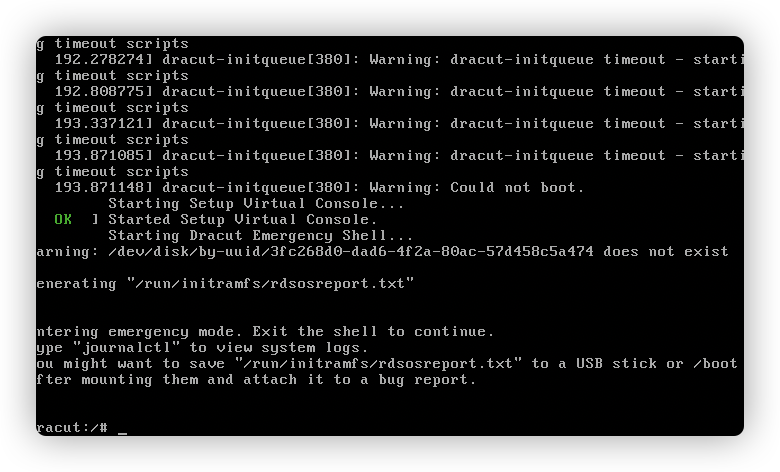
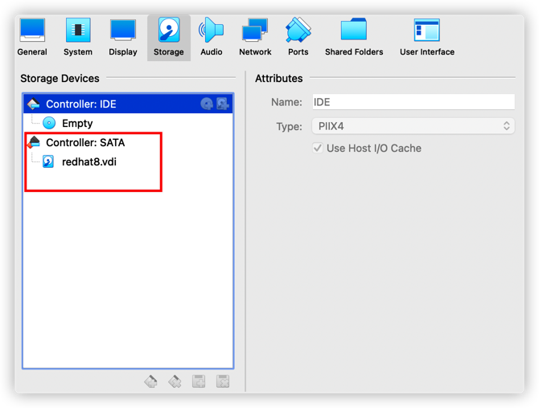
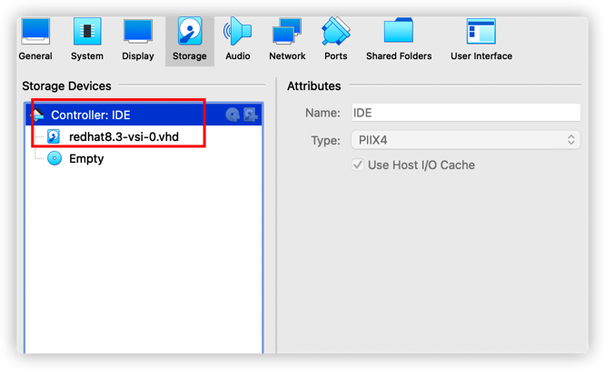

# Fix issue: dracut-initqueue timeout 

## Issue description
I download a redhat template image from cloud and try to run it in my local laptop Virtualbox, but when I boot up the machine, it shows this kind error:

```
[  193.845250]  dracut-initqueue[779]: Warning: dracut-initqueue timeout - starting timeout scripts
[...]
[  198.557262]  dracut-initqueue[779]: Warning: dracut-initqueue timeout - starting timeout scripts
[  198.557679]  dracut-initqueue[779]: Warning: Could not boot.
[  200.161146]  dracut-initqueue[779]: Warning: /dev/vgroot/root does not exist
[  200.170895]  systemd[1]: Starting Dracut Emergency Shell...
```


## Solution
Change the Virtualbox disk controller from SATA to IDE:


