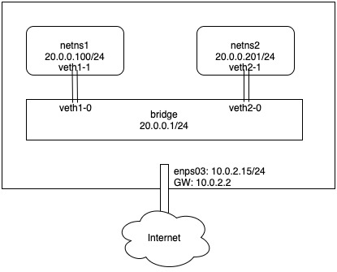

In the [netns-external-connect-snat], we've gave a method to make the network namespace to connect to the external network by SNAT. In this file, we will give another method, using bridge, to achieve the same goal.

## Test topology


In this test, we will use two network namespaces, and they connect to a bridge, and we want to achieve:
1. Two network namespaces can ping each other.
2. Two network namespaces can reach external network.

## Create network namespaces
```
# ip netns add netns1
# ip netns add netns2
# ip netns
netns2
netns1
```

## Add interfaces for namespaces
### Create two veth pair
```
# ip link add veth1-0 type veth peer name veth1-1
# ip link add veth2-0 type veth peer name veth2-1
# ip link
...
4: veth1-1@veth1-0: <BROADCAST,MULTICAST,M-DOWN> mtu 1500 qdisc noop state DOWN mode DEFAULT group default qlen 1000
    link/ether 9e:ec:51:37:8e:3c brd ff:ff:ff:ff:ff:ff
5: veth1-0@veth1-1: <BROADCAST,MULTICAST,M-DOWN> mtu 1500 qdisc noop state DOWN mode DEFAULT group default qlen 1000
    link/ether 26:f1:53:cb:ad:87 brd ff:ff:ff:ff:ff:ff
6: veth2-1@veth2-0: <BROADCAST,MULTICAST,M-DOWN> mtu 1500 qdisc noop state DOWN mode DEFAULT group default qlen 1000
    link/ether 96:35:32:5b:bf:9e brd ff:ff:ff:ff:ff:ff
7: veth2-0@veth2-1: <BROADCAST,MULTICAST,M-DOWN> mtu 1500 qdisc noop state DOWN mode DEFAULT group default qlen 1000
    link/ether 76:84:ff:88:21:f5 brd ff:ff:ff:ff:ff:ff
```

### Assign the peer into network namespaces
```
# ip link set veth1-1 netns netns1
# ip link set veth2-1 netns netns2
# ip link
...
5: veth1-0@if4: <BROADCAST,MULTICAST> mtu 1500 qdisc noop state DOWN mode DEFAULT group default qlen 1000
    link/ether 26:f1:53:cb:ad:87 brd ff:ff:ff:ff:ff:ff link-netns netns1
7: veth2-0@if6: <BROADCAST,MULTICAST> mtu 1500 qdisc noop state DOWN mode DEFAULT group default qlen 1000
    link/ether 76:84:ff:88:21:f5 brd ff:ff:ff:ff:ff:ff link-netns netns2
```

### Init netns1 interface
```
# ip netns exec netns1 ip link set dev lo up
# ip netns exec netns1 ifconfig veth1-1 20.0.0.100/24 up
# ip netns exec netns1 ip addr
1: lo: <LOOPBACK,UP,LOWER_UP> mtu 65536 qdisc noqueue state UNKNOWN group default qlen 1000
    link/loopback 00:00:00:00:00:00 brd 00:00:00:00:00:00
    inet 127.0.0.1/8 scope host lo
       valid_lft forever preferred_lft forever
    inet6 ::1/128 scope host
       valid_lft forever preferred_lft forever
4: veth1-1@if5: <BROADCAST,MULTICAST,UP,LOWER_UP> mtu 1500 qdisc noqueue state UP group default qlen 1000
    link/ether 9e:ec:51:37:8e:3c brd ff:ff:ff:ff:ff:ff link-netnsid 0
    inet 20.0.0.100/24 brd 20.0.0.255 scope global veth1-1
       valid_lft forever preferred_lft forever
    inet6 fe80::9cec:51ff:fe37:8e3c/64 scope link
       valid_lft forever preferred_lft forever
```

### Init netns2 interface
```
# ip netns exec netns2 ip link set dev lo up
# ip netns exec netns2 ifconfig veth2-1 20.0.0.200/24 up
# ip netns exec netns2 ip addr
1: lo: <LOOPBACK,UP,LOWER_UP> mtu 65536 qdisc noqueue state UNKNOWN group default qlen 1000
    link/loopback 00:00:00:00:00:00 brd 00:00:00:00:00:00
    inet 127.0.0.1/8 scope host lo
       valid_lft forever preferred_lft forever
    inet6 ::1/128 scope host
       valid_lft forever preferred_lft forever
6: veth2-1@if7: <BROADCAST,MULTICAST,UP,LOWER_UP> mtu 1500 qdisc noqueue state UP group default qlen 1000
    link/ether 96:35:32:5b:bf:9e brd ff:ff:ff:ff:ff:ff link-netnsid 0
    inet 20.0.0.200/24 brd 20.0.0.255 scope global veth2-1
       valid_lft forever preferred_lft forever
    inet6 fe80::9435:32ff:fe5b:bf9e/64 scope link
       valid_lft forever preferred_lft forever
```

## Create bridge
You can use `ip` cmd in the `iproute2` packet to create bridge:
```
# ip link add name br0 type bridge
# ip link set br0 up
```

And you can also use the `brctl` cmd in the `bridge-utils` to create, just like:
```
# brctl addbr br0
```

## Add veth interfaces to the bridge
```
# ip link set dev veth1-0 master br0
# ip link set dev veth2-0 master br0
# bridge link
5: veth1-0@if4: <BROADCAST,MULTICAST,UP,LOWER_UP> mtu 1500 master br0 state forwarding priority 32 cost 2
7: veth2-0@if6: <BROADCAST,MULTICAST,UP,LOWER_UP> mtu 1500 master br0 state forwarding priority 32 cost 2
# brctl show
bridge name	bridge id		    STP enabled	interfaces
br0		    8000.26f153cbad87	no		    veth1-0
							                veth2-0
```

By now, two network namespaces are connected to the bridge, and they can be ping each.
```
# ip netns exec netns1 ping 20.0.0.200 -c 1
PING 20.0.0.200 (20.0.0.200) 56(84) bytes of data.
64 bytes from 20.0.0.200: icmp_seq=1 ttl=64 time=0.025 ms

--- 20.0.0.200 ping statistics ---
1 packets transmitted, 1 received, 0% packet loss, time 0ms
rtt min/avg/max/mdev = 0.025/0.025/0.025/0.000 ms
```

# Connect to the external network
Now the network namespace can reach the local network (20.0.0.0/24), but it can not reach the external network
```
$ sudo ip netns exec netns1 ping 8.8.8.8
ping: connect: Network is unreachable
```
There is no route going out side:
```
#ip netns exec netns1 route -n
Kernel IP routing table
Destination     Gateway         Genmask         Flags Metric Ref    Use Iface
20.0.0.0        0.0.0.0         255.255.255.0   U     0      0        0 veth1-1
```


## Add default route for the network namespace
Let's add a default route with the br0 as the gateway. So first, let's set an IP address for the br0:
```
# ip addr add 20.0.0.1/24 dev br0
```

Then add default route in the netns1 and netns2 namespaces:
```
# ip netns exec netns1 ip route add default via 20.0.0.1
# ip netns exec netns2 ip route add default via 20.0.0.1
```

Let's verify the result, first, let's check whether the gateway can be reach:
```
ip netns exec netns1 ping 20.0.0.1 -c 1
PING 20.0.0.1 (20.0.0.1) 56(84) bytes of data.
64 bytes from 20.0.0.1: icmp_seq=1 ttl=64 time=0.025 ms

--- 20.0.0.1 ping statistics ---
1 packets transmitted, 1 received, 0% packet loss, time 0ms
rtt min/avg/max/mdev = 0.025/0.025/0.025/0.000 ms
```

Then let's ping outside:
```
# ip netns exec netns1 ping 8.8.8.8
PING 8.8.8.8 (8.8.8.8) 56(84) bytes of data.
^C
--- 8.8.8.8 ping statistics ---
3 packets transmitted, 0 received, 100% packet loss, time 2054ms
```

It's not reachable!!!

Let's capture the packets on the br0:
```
$ sudo tcpdump -i br0 -n
tcpdump: verbose output suppressed, use -v or -vv for full protocol decode
listening on br0, link-type EN10MB (Ethernet), capture size 262144 bytes
06:52:14.841745 IP 20.0.0.100 > 8.8.8.8: ICMP echo request, id 25688, seq 113, length 64
06:52:15.865860 IP 20.0.0.100 > 8.8.8.8: ICMP echo request, id 25688, seq 114, length 64
06:52:16.890111 IP 20.0.0.100 > 8.8.8.8: ICMP echo request, id 25688, seq 115, length 64
^C
3 packets captured
3 packets received by filter
0 packets dropped by kernel
```
We can see the ICMP packets sent to the br0. Then let's check which interface the packets should be routed out:

```
$ route -n
Kernel IP routing table
Destination     Gateway         Genmask         Flags Metric Ref    Use Iface
0.0.0.0         10.0.2.2        0.0.0.0         UG    100    0        0 enp0s3
10.0.2.0        0.0.0.0         255.255.255.0   U     0      0        0 enp0s3
10.0.2.2        0.0.0.0         255.255.255.255 UH    100    0        0 enp0s3
20.0.0.0        0.0.0.0         255.255.255.0   U     0      0        0 br0
192.168.99.0    0.0.0.0         255.255.255.0   U     0      0        0 enp0s8
```
It shows the the `enp0s3` is the external portal, then capture this interface:
```
$ sudo tcpdump -i enp0s3 -n
tcpdump: verbose output suppressed, use -v or -vv for full protocol decode
listening on enp0s3, link-type EN10MB (Ethernet), capture size 262144 bytes
^C
0 packets captured
0 packets received by filter
0 packets dropped by kernel
```
Nothing got. So this may be caused by the IP forwarding function.
```
$ cat /proc/sys/net/ipv4/ip_forward
0
```
Yeah, 0 means this function is not enabled, so let's enable the IP forwarding:
```
$ sudo sysctl -w net.ipv4.ip_forward=1
net.ipv4.ip_forward = 1
```

Then capture the outside interface again:
```
$ sudo tcpdump -i enp0s3 -n
tcpdump: verbose output suppressed, use -v or -vv for full protocol decode
listening on enp0s3, link-type EN10MB (Ethernet), capture size 262144 bytes
07:05:56.121871 IP 20.0.0.100 > 8.8.8.8: ICMP echo request, id 62108, seq 9, length 64
...
```
Now we can see the ICMP packets get out this interface, but there is no echo ICMP packets back. Let's continue to debug.
Since this `20.x.x.x` is an internal network, so it can not be back. So we need the iptable MASQUERADE to SNAT the source IP address to the external interface IP address on the host.
```
# iptables -t nat -A POSTROUTING -s 20.0.0.0/24 -j MASQUERADE
```

Then check the ping result:
```
# ip netns exec netns1 ping 8.8.8.8 -c 1
PING 8.8.8.8 (8.8.8.8) 56(84) bytes of data.
64 bytes from 8.8.8.8: icmp_seq=1 ttl=61 time=358 ms

--- 8.8.8.8 ping statistics ---
1 packets transmitted, 1 received, 0% packet loss, time 0ms
rtt min/avg/max/mdev = 357.874/357.874/357.874/0.000 ms
```
It works now.